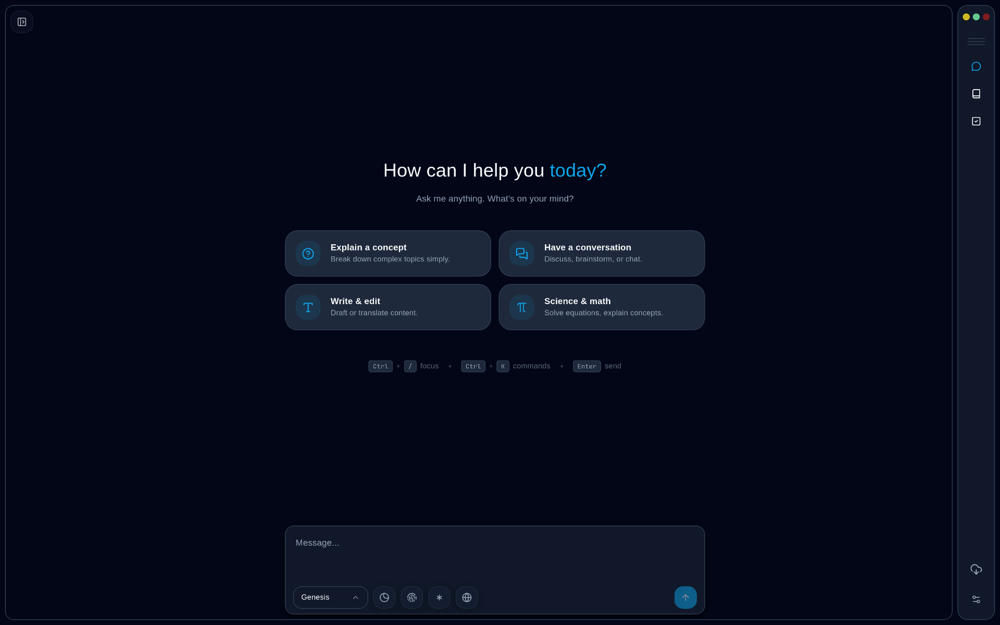
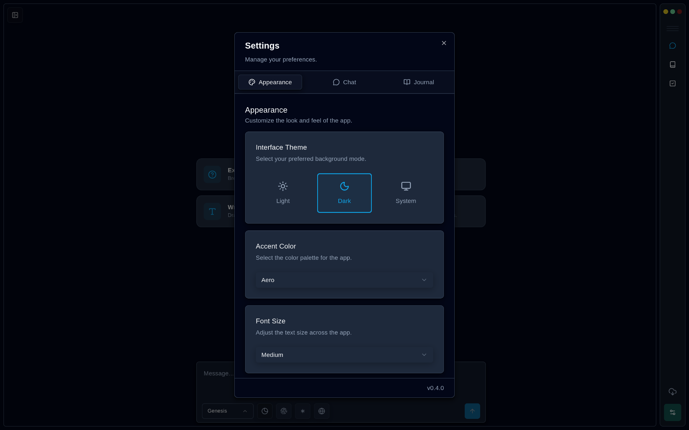
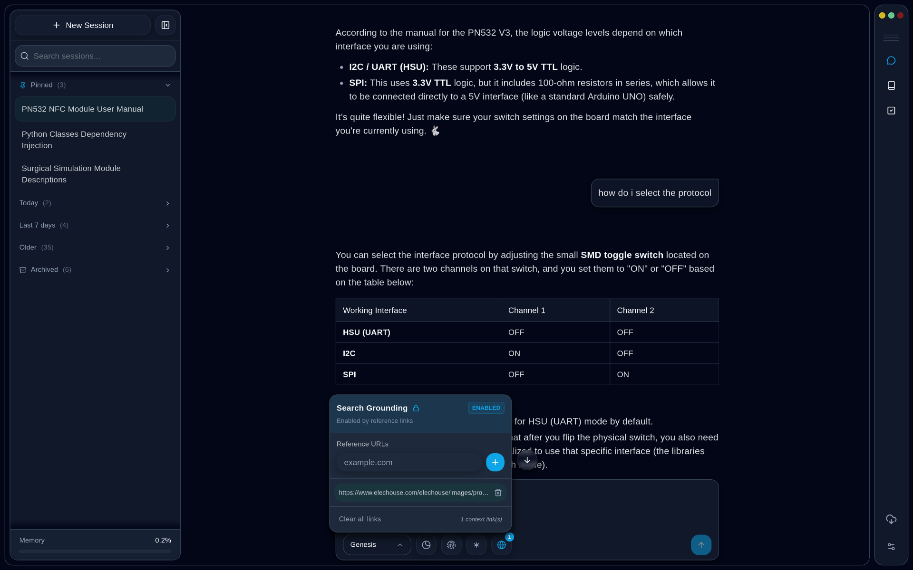
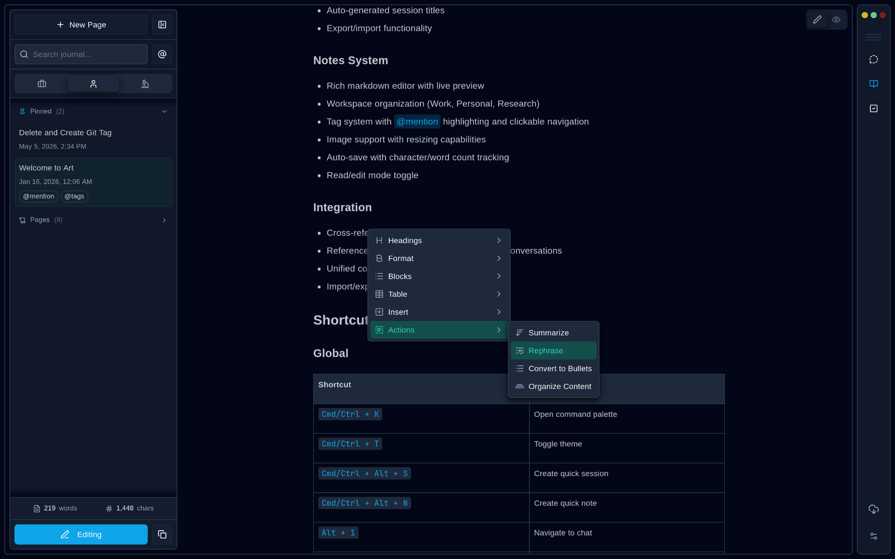
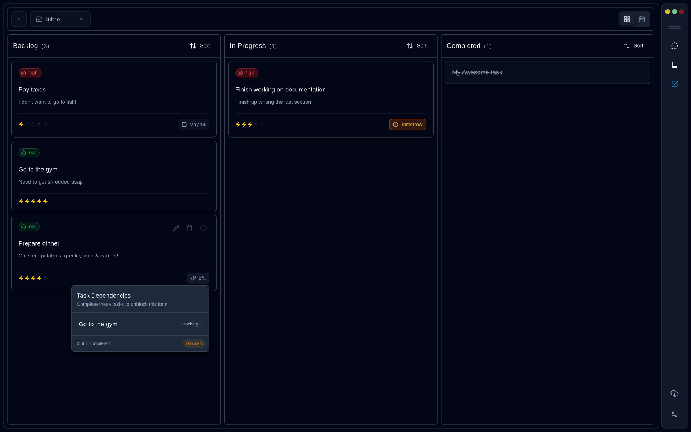
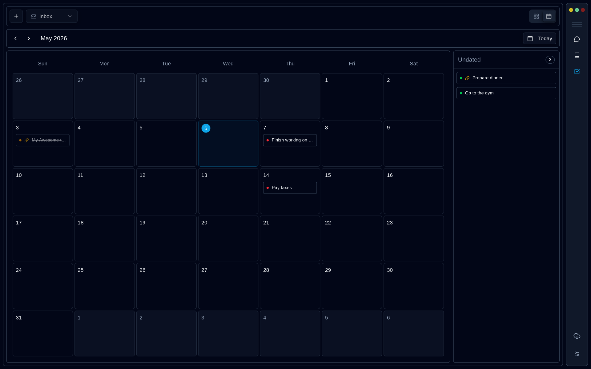
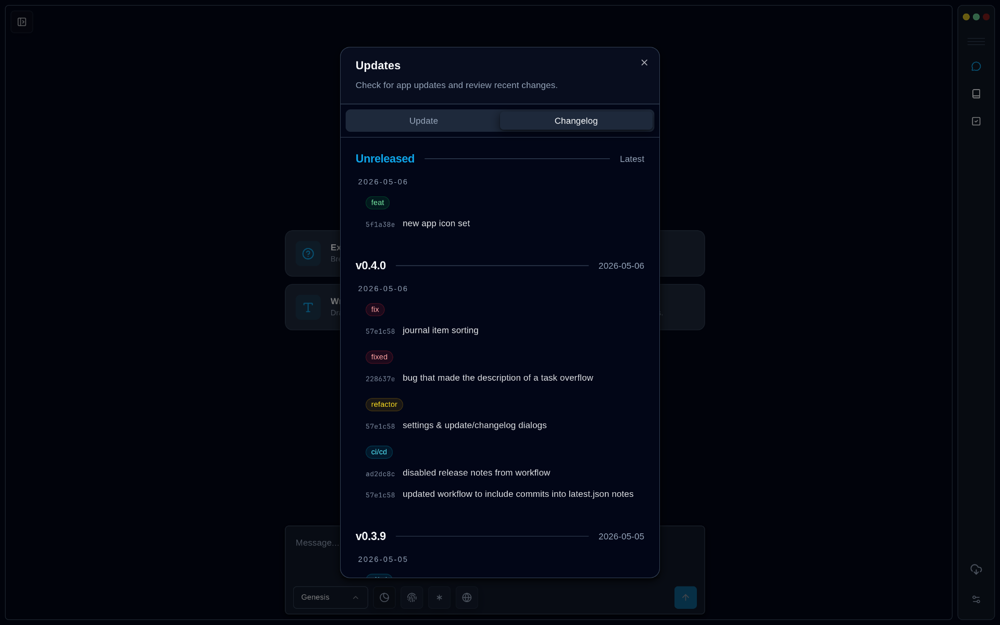

# Art

A personalized, local-first desktop workspace for chat, journaling, and task management.

Bring your own AI key, keep your workflow close to home, and organize thinking, writing, and execution in one place.

---

## Why Art?

Art is built for people who want one personal workspace instead of juggling disconnected tools.

- Local-first desktop experience
- AI chat with bring-your-own-key support
- Journals and notes that can become reusable context
- Task management in the same workspace
- Shared workflows across chat, writing, and planning
- Customizable interface, settings, and navigation

## Features

### Chat

Multi-session AI conversations with dedicated workflow modes.

- Chat, research, and tutor modes
- Rename, pin, archive, fork, import, and export sessions
- Search grounding
- Session persistence
- Bring your own API key
- Notes can be attached as context

### Journal

A rich writing space for notes, reflection, and reusable context.

- Rich text editor with auto-save
- Custom mentions and categories
- Image support with resizing
- Reading and editing modes
- AI-assisted workflows
- Markdown-oriented storage for efficient context use

### Tasks

A flexible bento-style board for planning and execution.

- Drag-and-drop organization
- Editable tasks and projects
- Due date tracking
- Task dependencies for hierarchical chains of execution
- Custom ordering
- Calendar view

### Productivity Tools

Extra utilities that support the rest of your workflow.

- Text utilities for summarizing, rewriting, and translating
- Shared context between parts of the app
- Command palette navigation
- Theme, text size, and UI customization
- In-app updates

## Download

Grab the latest build from [Releases](https://github.com/orbitaljin/art/releases).

| Platform              | File                          |
| --------------------- | ----------------------------- |
| macOS (Apple Silicon) | `.dmg`                        |
| macOS (Intel)         | `.dmg`                        |
| Windows               | `.exe`                        |
| Linux                 | `.deb` / `.rpm` / `.AppImage` |

Updates are handled in-app. Through the built-in updater, you can update to the latest version.

## Detailed Progress

See [TODO.md](./TODO.md) for feature progress, shipped work, and planned items.

---

Built by **orbitaljin**
