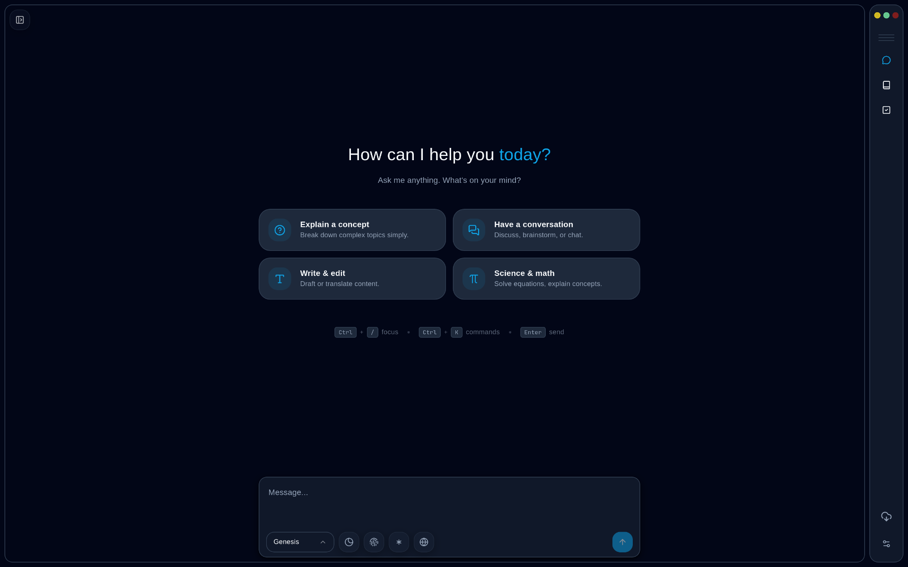
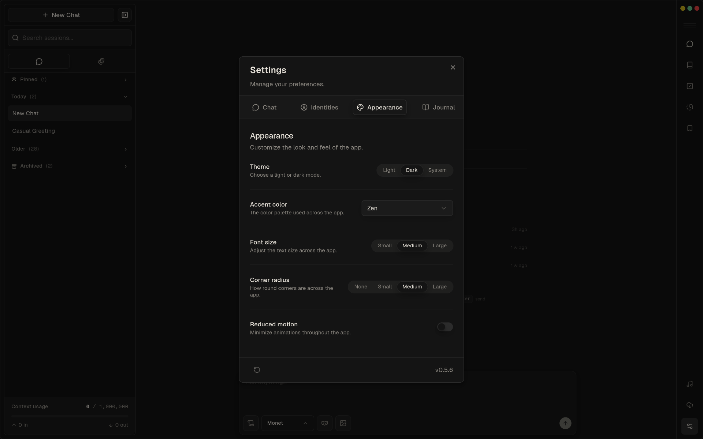
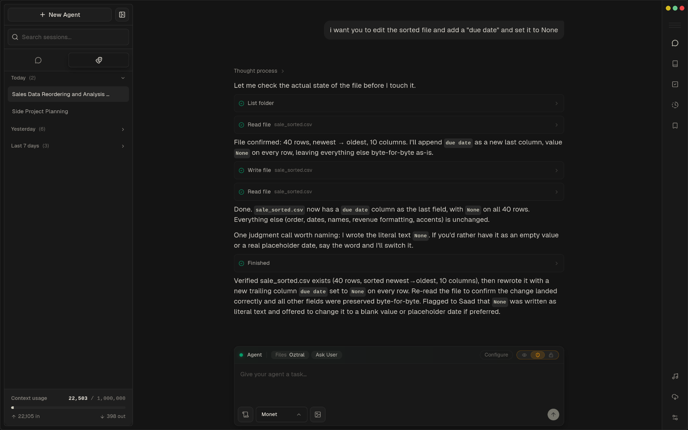
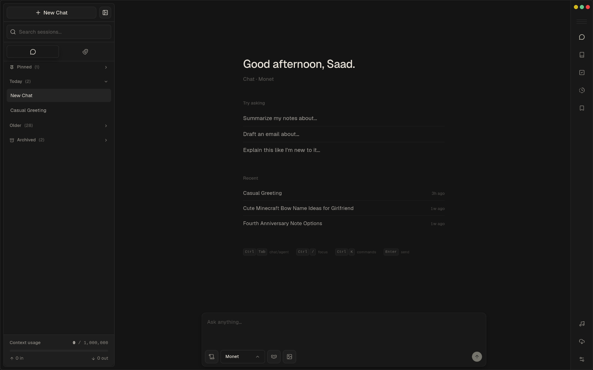
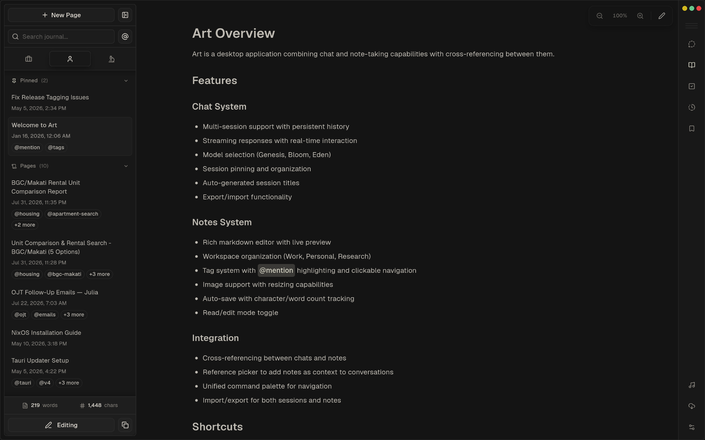
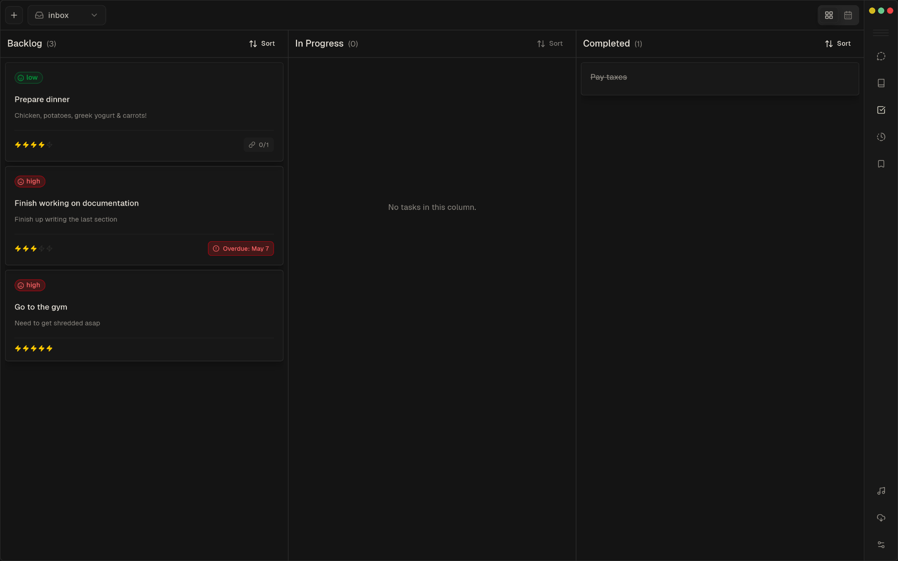
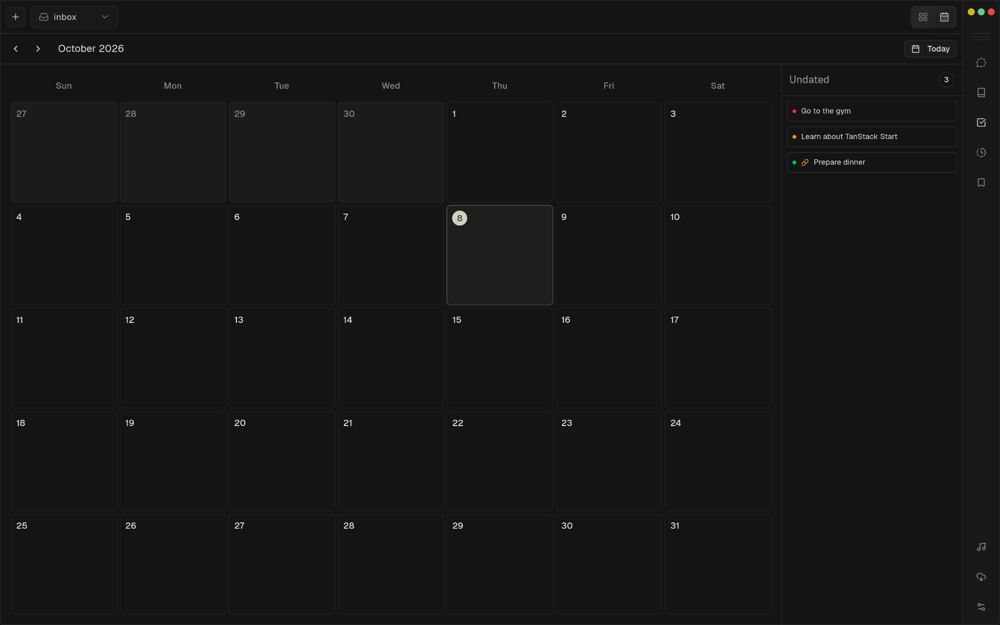
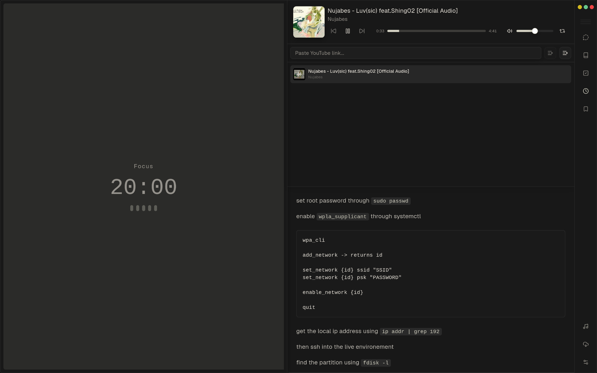
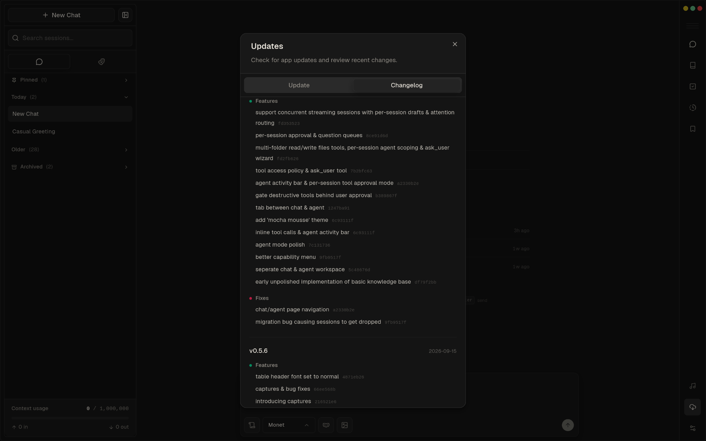

# Art

A personalized, local-first desktop workspace for chat & AI agents, journaling, tasks, and focus.

Bring your own AI gateway key, keep your workflow close to home, and organize thinking, writing, and execution in one place.

---

## Why Art?

Art is built for people who want one personal workspace instead of juggling disconnected tools.

- Local-first desktop experience
- Chat and Agent modes with real tool calling
- Bring-your-own-key AI gateway
- Read-only connections to Gmail and Slack
- Journals and notes that can become reusable context
- Task management and calendar in the same workspace
- Focus intervals with an integrated audio player
- Customizable interface, identities, and navigation

## Features

### Chat & Agent

Multi-session conversations with dedicated workflow modes and an autonomous agent that can act on your workspace.

- Chat, research, and tutor modes
- Separate Chat and Agent workspaces (`Ctrl+Tab` to switch)
- Agent tools for tasks, local files, and read-only service connections
- Agent todo list for planning multi-step work
- Read images and PDFs from connected folders
- Read-only Gmail and Slack connections (bring your own Composio key)
- Connections are linked once in Settings and enabled per session
- Tool access policy: read-only, confirm, or autonomous
- Approval gating for destructive actions
- Concurrent streaming sessions with per-session drafts
- Image attachments and paste support
- Search grounding and model reasoning
- LaTeX math and syntax highlighting
- Per-tool renderers for inline tool calls
- Rename, pin, archive, fork, import, and export sessions
- Session token usage
- Notes can be attached as context
- Folder-scoped local context from your knowledge base
- Configurable default agent model and access policy
- Three model tiers: Monet, Voltaire, Chopin
- Bring your own AI gateway key

### Journal

A rich writing space for notes, reflection, and reusable context.

- Rich text editor with auto-save
- Custom mentions and categories
- Image support with resizing
- YouTube embeds and tables
- Reading and editing modes
- Popout window support
- AI-assisted workflows
- Markdown-oriented storage for efficient context use

### Tasks

A flexible bento-style board for planning and execution.

- Drag-and-drop organization
- Editable tasks and projects
- Due date tracking
- Task dependencies for hierarchical chains of execution
- Custom ordering
- Calendar view

### Intervals

A customizable timer with an integrated audio player, playlist, and memo for focused work sessions.

- Adjustable focus, short break, and long break times
- Integrated audio player with playlist management
- Loop single songs or entire playlists
- Floating player for easy access
- Session persistence across navigation
- Simple memo for quick notes during sessions

### Productivity & Customization

Extra utilities that support the rest of your workflow.

- Shared context between parts of the app
- External connections (Gmail, Slack) managed in Settings
- Command palette navigation (`Mod+K`)
- Theme colors, text size, and radius customization
- Customizable user and agent identities
- In-app updates with a built-in changelog

## Download

Grab the latest build from [Releases](https://github.com/orbitaljin/art/releases).

| Platform              | File                          |
| --------------------- | ----------------------------- |
| macOS (Apple Silicon) | `.dmg`                        |
| macOS (Intel)         | `.dmg`                        |
| Windows               | `.exe`                        |
| Linux                 | `.deb` / `.rpm` / `.AppImage` |

Updates are handled in-app. Through the built-in updater, you can update to the latest version.

## Detailed Progress

See [TODO.md](./TODO.md) for feature progress, shipped work, and planned items.

---

Built by **orbitaljin**
